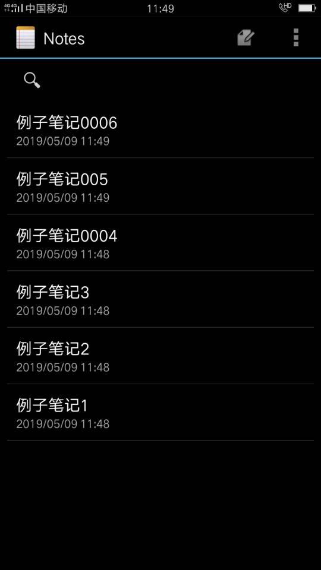

# 笔记列表显示笔记条目的修改时间

## 一、效果截图




## 二、实现思路

在原始项目中，notes表已设计了modified字段用于保存笔记条目的修改时间（数据表的创建代码见NotePadProvider类的内部类DatabaseHelper类的onCreate()方法），在更新某个笔记条目时，原始代码会调用System.currentTimeMillis()方法获取系统当前时间，并更新modified字段值（详见NotePadProvider类的insert()方法）。


因此，我们只需直接查询出modified字段值并添加到相应视图即可。改写PROJECTION：

```java
private static final String[] PROJECTION = new String[]{
        NotePad.Notes._ID, // 0
        NotePad.Notes.COLUMN_NAME_TITLE, // 1
        NotePad.Notes.COLUMN_NAME_MODIFICATION_DATE, // 2 ---新加的映射字段
        // 例如，从cursor中取某条记录的modified字段值时，调用cursor.getLong(2)即可
};
```

再改写相应字段映射（须先修改[list item的视图](https://github.com/xkfx/notepad/blob/master/app/src/main/res/layout/noteslist_item.xml)）：

```java
// The names of the cursor columns to display in the view, initialized to the title column
String[] dataColumns = {NotePad.Notes.COLUMN_NAME_TITLE, NotePad.Notes.COLUMN_NAME_MODIFICATION_DATE};

// The view IDs that will display the cursor columns, initialized to the TextView in
// noteslist_item.xml
int[] viewIDs = {android.R.id.text1, R.id.listItem_sub_title};
```

即可。


另外一个须注意的是，modified字段所保存的是一个Long型的“以毫秒数”保存的时间，在查出modified字段值后应转化为一般时间格式。简单设置一下SimpleCursorAdapter就行了：

```java
// 将日期字段由timeMillis格式化为yyyy/MM/dd HH:mm
adapter.setViewBinder(new SimpleCursorAdapter.ViewBinder() {
    @Override
    public boolean setViewValue(View view, Cursor cursor, int i) {
        if (i == 2) { // 倘若是第二列字段
            String modified = DateUtil.timeMillis2Date(cursor.getLong(2));
            TextView textView = (TextView) view;
            textView.setText(modified);
            return true;
        }
        return false;
    }
});
```

DateUtil是自定义的一个工具类。详见[com.example.android.notepad.util.DateUtil ](https://github.com/xkfx/notepad/blob/master/app/src/main/java/com/example/android/notepad/util/DateUtil.java)

